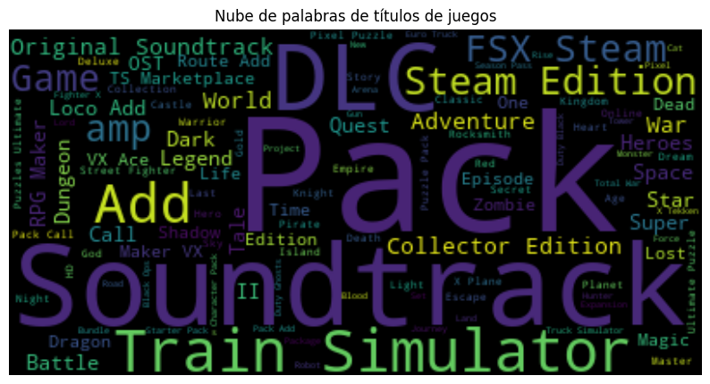

Este es un proyecto de aprendizaje automático que utiliza FastAPI, pandas, scikit-learn y otras bibliotecas para realizar análisis de datos y predicciones.

## Instalación

Para instalar las dependencias del proyecto, ejecuta el siguiente comando:

```bash
pip install -r requirements.txt

Para instalar las dependencias del proyecto, ejecuta el siguiente comando:
txt
Uso
Para iniciar la aplicación, ejecuta el siguiente comando:

uvicorn main:app --host 0.0.0.0 --port 80

80
Funcionalidades
Análisis exploratorio de datos en un Jupyter Notebook.
Creación de una nube de palabras a partir de los títulos de los juegos.
Predicciones utilizando un modelo de aprendizaje automático.
Despliegue
El proyecto se despliega en Render. Para iniciar un nuevo despliegue, ve al panel de control de Render y haz clic en "Redeploy".

Contribuciones
Las contribuciones son bienvenidas. Por favor, abre un issue para discutir lo que te gustaría cambiar.
